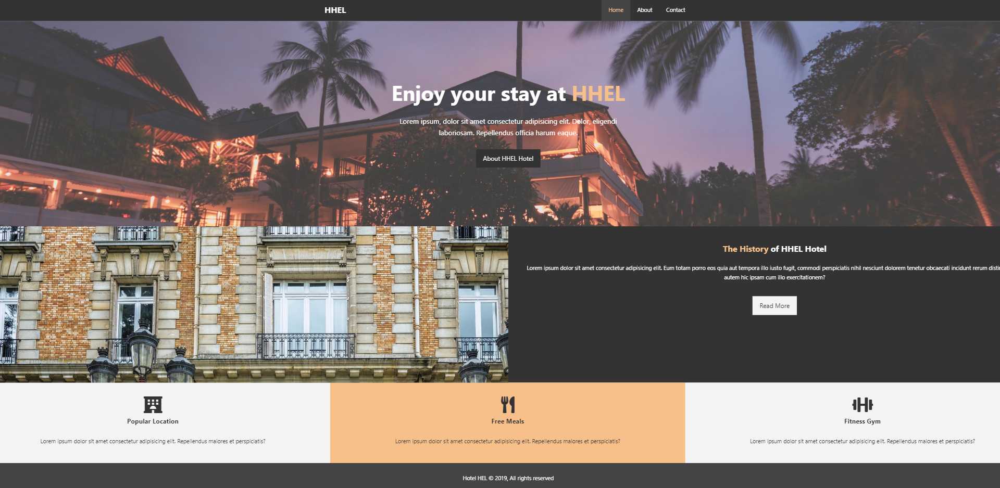

This is a basic HTML5 & CSS3 project using Floats only. No Grid system or Flexbox has been used. The purpose of this project was to layout the Page using floats only and to learn in detail about positioning in CSS3 using floats. Website is also responsive as much as possible through floats.

To run the project, Download or clone it on your machine and open it on your browser.

